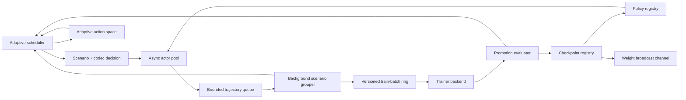

# Architecture

## Contract

The control plane has these stable contracts:

1. `RolloutWorkflow`: user code receives a policy snapshot, a scenario, and a rollout context, then returns a rewarded `Trajectory`.
2. `TrainerBackend`: training consumes `TrajectoryGroup` batches and returns a `TrainResult` with optional replacement policy and checkpoint metadata.
3. `ActionCodec`: policy decisions are represented as semantic `ActionUnit` objects instead of assuming one generated token per action.
4. `AdaptiveScheduler`: rollout selection, train-batch priority, batch cadence, policy lag, action granularity, and continuation are chosen from reward-per-cost feedback.
5. `VersionedTrajectoryBatch`: grouped training payloads carry the policy-step range they were collected under.
6. `PromotionEvaluator`: optional user code decides whether a trained candidate becomes the served checkpoint.
7. `WeightBroadcastChannel`: promoted checkpoint updates are explicit events that inference workers or adapters can subscribe to.
8. `RuntimeTelemetry`: actor, queue, trainer, promotion, reward, cost, and staleness signals are reported in one run summary.
9. `art_adapter`: optional structural conversion for ART `Trajectory` and `TrajectoryGroup` objects without importing ART in the core package.

## Runtime Loop



Actors continuously run user-defined workflows. Completed trajectories enter a bounded queue, so slow grouping applies backpressure rather than unbounded memory growth. If a workflow does not provide explicit sample/API/tool cost, the runtime stamps duration-derived `rollout/dollar_seconds` on the trajectory before enqueue, giving queued train-batch priority the same sample denominator as rollout feedback. A background batcher consumes those trajectories, forms same-scenario groups, and writes `VersionedTrajectoryBatch` objects into a bounded train-batch ring.

The trainer consumes the highest-priority non-stale batch from the ring and returns a candidate policy. A promotion gate decides whether that candidate becomes the served checkpoint and is broadcast. Trajectories whose policy step is older than `max_policy_lag` are dropped during grouping. Whole train batches can also be discarded if they become too stale while waiting in the ring.

## Closed-Loop Objective Scheduler

`ObjectiveScheduler` turns the north-star metric into online control decisions. It treats each `(scenario, action_codec)` pair as an arm, explores every arm, then prefers arms with higher marginal reward improvement per dollar-second. Rollout outcomes provide the first signal; consumed train batches then credit actual train-step improvement back to the arms and active runtime controls that produced the trajectories. Cadence, policy-lag, active-actor-count, and admission-delay values are also explored as bounded control candidates and scored from rollout/train/stale feedback, so the runtime can discover that a non-default batch cadence, lag allowance, actor cap, or pre-rollout delay produces more reward-improving experience per dollar-second. Concurrent actor selections reserve in-flight arms until their rollout feedback is observed, preventing high-throughput actors from all choosing the same untried arm before the first result returns. First-time exploration remains protected, but unobserved arms are ordered by estimated rollout dollar-seconds when sibling scenario, sibling codec, or global sample-cost evidence exists; the chosen estimate and cost penalty are emitted in decision metadata and metrics. With `min_rollout_coverage_fraction`, the scheduler can also force the most under-covered arm after the initial sweep until its decision share reaches a capped coverage floor, then return to pure objective selection. `max_rollout_coverage_cost_fraction` can cap that override by active-arm rollout spend share, so an expensive diagnostic arm does not keep winning fairness overrides after it has already consumed too much of the denominator. Train-batch priority is quality-adjusted from the actual queued trajectories, so verifier-failed or unsafe samples do not inherit high priority merely because the arm was useful previously. When action units carry old/new logprobs, queued batch priority is also discounted by absolute policy-probability drift, damped by logprob-pair coverage; the same drift can prefer minimum batch cadence and the minimum policy-lag limit before more off-policy samples are admitted. Unaccounted batches keep the previous priority, cadence, and lag behavior. Per-actor attribution records rollout, train, stale, queue-wait, and admission cost under `scheduler/actor/*`, so active actor-count changes can be audited by which actor slots produced or wasted reward-improving experience. The scheduler can lower the active actor cap and impose pre-rollout actor admission delay under downstream queue saturation: low-signal saturation starts from a lower actor cap and higher delay preference before actor-count feedback exists, while positive marginal objective signal or stronger actor-count feedback lets useful sampling keep flowing. Train credit is arm-baseline-aware: a batch only creates reward-improving experience for an arm when the train score improves over that arm's own previous train score, preventing alternating workflows from inheriting each other's baselines. When runtime controls learn from the accounted interval objective, the scheduler scales each arm's train-improvement credit to the accounted denominator instead of redistributing global credit by raw trajectory reward.

The scheduler currently controls nine things:

- **Rollout choice:** which `Scenario` an actor attempts next.
- **Action granularity:** which `ActionCodec` the workflow receives in `RolloutContext`.
- **Coverage floor:** whether under-covered scenario/action arms temporarily override the best current objective estimate, subject to an optional spend-share cap.
- **Actor count:** how many actors in the static pool may actively produce rollouts.
- **Actor admission:** whether saturated downstream queues warrant pre-rollout delay.
- **Training priority:** which ready train batch the ring should consume next.
- **Batch cadence:** target train groups per `VersionedTrajectoryBatch`.
- **Policy lag:** current max accepted rollout/checkpoint lag.
- **Continuation:** whether another training step is worth spending on.

Use it by passing multiple codecs and a scheduler:

```python
summary = await ControlPlane(config).run(
    scenarios=scenarios,
    initial_policy=policy,
    trainer=trainer,
    workflow=rollout,
    action_codecs=[TokenActionCodec(), ChunkActionCodec(chunk_size=4)],
    scheduler=ObjectiveScheduler(),
)
```

For an adaptive CALM-like chunk ladder, pass an `AdaptiveActionSpace` instead of a fixed codec list:

```python
summary = await ControlPlane(config).run(
    scenarios=scenarios,
    initial_policy=policy,
    trainer=trainer,
    workflow=rollout,
    action_space=AdaptiveActionSpace(min_chunk_size=2, max_chunk_size=8),
    scheduler=ObjectiveScheduler(),
)
```

The action space starts with token and small chunk codecs. After rollout feedback updates scheduler metrics, it can run a promotion-only refresh and add a larger `ChunkActionCodec` when the current chunk size has at least `promotion_min_pulls` live observations, positive objective signal, high action quality, low unsafe rate, low reconstruction drift, observed semantic bandwidth, and enough reward-improving objective advantage over its active lower-bandwidth parent when that parent has evidence. With `promote_latent_patches=True`, the same evidence can introduce a deterministic `LatentPatchActionCodec` for that chunk size, even when the chunk ladder has reached `max_chunk_size`. Train feedback, and stale feedback when `demote_on_stale_feedback=True`, can disable promoted chunk and latent-patch codecs after enough bad evidence, using objective score, action quality, semantic bandwidth, unsafe rate, reconstruction drift, pull count, and nearest-parent objective comparison. When a promoted chunk is retired, latent-patch codecs at that patch size or larger are retired with it so failed higher-bandwidth branches stop competing for rollout slots. Actors read the current action-space codecs before each rollout, so newly promoted or retired action granularities affect the same run without restarting sample production. Before each local or ART-bridge rollout selection, the runtime passes a stable `action_space_signature()` for the active/disabled codec ladder into the scheduler, letting full scheduling-action credit distinguish identical arm/runtime controls under different adaptive action-space states.

Action-space state is checkpointable. `AdaptiveActionSpace.state_dict()` captures active codecs, disabled codec keys, promotion/demotion counters, and configuration. `action_space_signature()` exposes the active/disabled codec ladder as a metric-safe key component for scheduler decisions. `load_state_dict()` restores built-in token, chunk, latent-patch, command, and reasoning-step codecs directly; unknown custom codecs are restored only when an equivalent codec is already present on the action space. `ControlPlane` writes this state under `action_space/state` after scheduler feedback has promoted or retired codecs for the train step.

Action units make probability accounting explicit. `ActionUnit` can carry `old_logprob`, `new_logprob`, and `reference_logprob` fields, or equivalent metadata keys preserved from ART backends. Runtime telemetry and per-arm scheduler metrics report old/new/reference coverage, old-new logprob deltas, absolute old-new drift, sampled reference deltas, and importance-ratio means. The scheduler uses absolute old-new drift to discount queued train-batch priority and tighten cadence and policy lag when probability-accounted samples move far from their behavior policy. `AdaptiveActionSpace` can require those coverage metrics before promotion or demote codecs whose configured probability-accounting coverage disappears, so chunk and latent-patch experiments can be kept inside a trainable GRPO/CISPO contract instead of only measuring semantic bandwidth.

The control loop is online:

1. Actors ask the scheduler whether they are inside the active actor cap and whether saturated downstream queues warrant pre-rollout admission delay, then request a scenario and action codec, reserving that arm as in-flight until the rollout is observed.
2. Runtime tags the resulting trajectory with the scheduler arm and active runtime-control values.
3. Workflows or verifiers can attach action-quality and failure metadata such as `action/safe`, `action/quality`, `reconstruction/accuracy`, `reconstruction/safe`, `verifier/score`, `verifier/passed`, `failure/mode`, `failure/modes`, `verifier/failure_mode`, or `verifier/failure_modes`.
4. The batcher reports accepted or rejected rollout outcomes, effective reward, action quality, and dollar-seconds.
5. The scheduler scores each candidate train batch from the arms, effective rewards, and quality signals inside it.
6. The ring serves the highest-priority non-stale batch to the trainer.
7. The trainer reports reward movement, useful trajectory count, and train dollar-seconds.
8. The promotion evaluator accepts or rejects the candidate policy and reports candidate score, baseline score, improvement, reason, and evaluation dollar-seconds.
9. The scheduler computes train objective from the promotion-effective score when present, otherwise from `train/reward`.
10. The scheduler distributes that policy-improvement objective back onto the contributing scenario/action-codec arms.
11. Rollout feedback immediately credits the active actor-count and admission-delay values stamped on sampled trajectories. When `rollout_cadence_lag_control_weight` is positive, it also credits stamped train-batch cadence and policy-lag values; train feedback credits the runtime-control values used by consumed trajectories.
12. The adaptive action space can promote or retire higher-bandwidth chunk codecs from that feedback.
13. The scheduler scores candidate actor-count, cadence, policy-lag, and admission-delay values with observed objective plus a small exploration term, then reuses values whose rollout/train/stale feedback beats the default heuristic.
14. If configured with ROI patience, the scheduler stops the run early after repeated low-objective train steps.

The scheduler keeps the configured policy-lag allowance until every known arm has at least one accepted sample, unless lag-specific train or stale feedback already exists. That prevents the closed loop from dropping exploratory rollouts before it has enough evidence to compare action granularities, while still letting stale-waste feedback tighten lag after the configured allowance has been shown to waste experience.

Arm scoring is objective-weighted. The default score is marginal rollout reward-improvement per dollar-second plus credited train-step policy-improvement objective. Train-step objective uses each arm's `max(0, reward - previous_arm_reward) * useful_trajectory_count / candidate_dollar_seconds`, so larger useful batches earn proportionally more credit than equally improving tiny batches. `candidate_dollar_seconds` is trainer spend plus promotion-evaluation overhead that is not already itemized as held-out rollout trajectory cost. Trainer spend can come from explicit trainer metrics or metadata under `cost/dollar_seconds`, `train/dollar_seconds`, or `trainer/dollar_seconds`; otherwise trainer duration is multiplied by the configured infrastructure rate. Raw reward efficiency is reported but has weight `0` unless the caller explicitly sets `reward_efficiency_weight`; this keeps the controller from chasing high raw rollout scores that are no longer improving the policy.

Reward-scale normalization is opt-in for heterogeneous ART workflows. With `reward_scale_normalization="arm_range"`, the scheduler still records raw reward improvement and raw reward-improving experience, but rollout marginal objective and train policy-improvement credit divide positive improvement by that arm's observed effective-reward or train-score range, including the implicit zero baseline for the first improvement. Metrics expose raw and normalized per-arm totals plus `scheduler/train_last_control_reward_improving_experience`, so operators can audit when the controller chose a lower-raw-reward workflow because it produced stronger scale-adjusted improvement per dollar-second.

Confidence-aware scoring is opt-in. Every rollout, train-credit, and stale-penalty objective sample updates per-arm online mean and variance. Setting `confidence_penalty_weight` subtracts an uncertainty penalty from each arm's raw objective score, based on objective standard deviation and sample count. Metrics expose `raw_objective_score`, `confidence_penalty`, `objective_observations`, `objective_mean`, and `objective_stddev` per arm, so operators can see whether the scheduler is avoiding a genuinely bad arm or merely discounting noisy low-evidence signal.

Cadence is pressure-aware, explored, and credited. The configured value is the conservative first choice. When the train ring is saturated and the scheduler has no positive objective signal, it widens train batches toward `max_train_batch_groups` to amortize trainer spend before cadence feedback exists; after train or stale feedback has scored cadence candidates, that feedback can override pressured widening. Actor count, cadence, and policy-lag decisions are chosen from bounded integer candidate sets scored by observed control objective plus `control_exploration_bonus`; `max_control_candidate_values` limits the lattice size for wide ranges. Actors share a local actor-cap lease before rollout: slots above the scheduler-selected active actor count yield without creating separate control probes, admitted trajectories are tagged with `scheduler/active_actor_count`, and an entirely unspent cap lease is cancelled so rollout, train, and stale feedback score only cap decisions that admitted work. Saturation and low-ROI train intervals prefer the minimum actor cap before actor-count feedback exists, then actor-count scores can override that backoff. Actor queue-wait cost is stamped onto trajectories before enqueue and included in the scheduler's rollout denominator, so backpressure can reduce the marginal objective of arms and control settings that create it. Pre-rollout admission delay uses the same control selector over millisecond delay candidates. Runtime stamps `scheduler/active_rollout_admission_delay_ms` and `cost/actor_admission_dollar_seconds` onto produced trajectories, so admission cost affects per-arm rollout objective and the chosen delay receives rollout, train, and stale credit under `scheduler/control/admission_delay_ms_*`. Runtime also stamps cadence and policy-lag values on produced trajectories; with `rollout_cadence_lag_control_weight > 0`, rollout outcomes can score `scheduler/control/cadence_*` and `scheduler/control/policy_lag_*` before a train batch is consumed. Consumed train batches also credit the active cadence and policy-lag values under `scheduler/control/*`; by default `control_train_objective="accounted"` uses the train interval's reward-improving useful experience divided by rollout, queue, admission, trainer, trainer-wait, and promotion spend, letting later decisions reuse settings that improve the north-star denominator rather than only trainer-local ROI. Set `control_train_objective="train"` to preserve candidate-train-cost control credit.

Joint scheduling actions are checkpointed evidence, not just trace strings. Local `ControlPlane` rollouts and external `AsyncArtBackend.admit_and_select_rollout()` assignments stamp `scheduler/joint_action_key`, combining the chosen arm, cadence, policy-lag limit, actor cap, admission-delay bucket, and, when present, the active action-space signature. The joint tuple decision is recorded when a rollout is selected and cancelled if the reservation is released before spend, while rollout, train, and stale feedback update string-keyed payoff stats under `scheduler/joint_action/*`. This exposes the marginal reward-improvement efficiency of the full control tuple even when individual control families look ambiguous, and prevents a promoted or retired action-space ladder from sharing exact payoff credit with its predecessor. During rollout selection, the scheduler receives the already chosen actor cap and admission-delay bucket and adds matching tuple payoff to arm scoring through `joint_action_objective_weight`, so interaction evidence can change which scenario/action arm is selected for that runtime context. The same observed tuple payoff also biases bounded cadence, lag, actor-cap, and admission-delay candidate selection using partial context: actor cap can reuse the best matching actor tuple, admission delay can condition on the chosen actor cap, cadence can condition on actor cap and admission delay, and lag can condition on the chosen cadence plus admission context. The tuple parser is name-based, so old keys and new keys with `action_space=...` still contribute to those partial runtime-control scores.

Train-batch priority is live. `TrajectoryRingBuffer.get()` can rescore each non-stale queued batch at the current policy step before choosing what the trainer consumes. `ObjectiveScheduler.score_train_groups()` uses marginal rollout objective, train-improvement objective, observed full scheduling-action tuple payoff, optional raw reward efficiency, stale-risk boost for positive-value batches whose current policy lag is close to the active lag limit stamped on the batch, and off-policy drift discounting for probability-accounted action units. When queued trajectories carry explicit sample/API/tool dollar-seconds, the priority estimate multiplies expected value by useful experience count and divides by that batch's sample cost before applying stale-risk and off-policy adjustments. This lets useful near-stale experience from high-payoff joint scheduling tuples train before it becomes a stale-drop penalty, while low-value, high-cost, low-tuple-payoff, or high-drift batches still lose to stronger objective evidence.

Stale train-ring drops are negative feedback, not just telemetry. When a queued `VersionedTrajectoryBatch` becomes too stale to train, the runtime reports the discarded groups through `observe_stale_batch_feedback()`. `ObjectiveScheduler` estimates the lost reward-improving experience from the stale arms' current objective values and sample dollar-seconds, then converts that loss into configurable negative objective credit. Before an arm has positive value evidence, it falls back to quality-weighted useful experience. The resulting penalty debits the arms, batch-cadence values, and policy-lag values that produced the untrained samples. If an adaptive action space is attached with `demote_on_stale_feedback=True`, the stale callback also runs a demotion-only refresh so a higher-bandwidth codec that produces stale, untrained experience can stop competing for rollout slots.

Promotion is programmable. Without a `PromotionEvaluator`, every train result is promoted to preserve the simple ART-like training loop. With one, a `TrainResult` becomes a candidate. Rejected candidates still count as train spend and promotion-evaluation spend, but they do not advance `PolicyRegistry`, do not append a checkpoint, and do not publish a `WeightUpdate`. `MetricPromotionEvaluator` promotes only when a chosen result metric improves beyond `min_delta`. `RolloutPromotionEvaluator` runs the candidate policy through held-out `Scenario` objects with the same `RolloutWorkflow` contract used by sample production, then scores quality-adjusted reward and records evaluation failures, semantic bandwidth, duration, and dollar-seconds. Those held-out trajectories are tagged with scheduler arm metadata and passed through `ObjectiveScheduler.observe_rollout()`, so eval reward, action quality, failures, and explicit `eval/dollar_seconds` costs become reusable control evidence; when an adaptive action space is attached, the same eval rollout evidence can run a promotion-only refresh before train feedback. Custom evaluators can run other checks and return `PromotionDecision` directly. The runtime writes promotion score, baseline, improvement, cost, and reason into candidate metrics/metadata; `ObjectiveScheduler.observe_train()` reads `promotion/score` first and divides by trainer plus only the promotion-evaluation overhead not already observed as held-out rollout cost, so rejected or expensive candidates do not receive false positive policy-improvement credit and itemized eval rollouts are not double counted. Runtime telemetry also reports `promotion/published_policy_reward_improving_experience`, which accumulates only positive promoted-score improvement times useful trajectories in the promoted batch. Built-in evaluators also write `promotion/state` into accepted checkpoint metadata, preserving the best accepted score and numeric promotion configuration across resumed runs.

Action quality is part of the objective. Unsafe or failed high-bandwidth actions get an effective reward multiplier of `0`, so a risky chunk arm cannot win merely by reporting a high raw reward when reconstruction or verification fails. Domain-specific verifier failures can be supplied through `failure/*`, `verifier/failure_*`, `action/failure_*`, or `rollout/failure_*` metadata and are folded into the same checkpointed failure-mode counters and failure-rate signal as built-in failures. The scheduler also records reconstruction accuracy mean, minimum, EMA, drift EMA, and max drift per arm, so the action-space controller can reject or retire semantically compressed codecs before drift becomes hidden policy-improvement credit.

Train credit is also quality-aware. A batch can improve the trainer's reported reward, but unsafe or zero-quality trajectories in that batch receive no per-arm policy-improvement credit. This keeps the rollout scheduler pointed at action granularities that produce useful trainable experience rather than merely high raw rollout scores.

Continuation control is opt-in beyond `max_train_steps`. Setting `roi_patience` and `min_train_objective` lets the scheduler stop spending once marginal reward improvement per dollar-second has stayed too low for the configured patience window. The default `continuation_objective="train"` uses the train candidate denominator, preserving a trainer-local loop. Setting `continuation_objective="accounted"` uses the same reward-improving experience numerator divided by the rollout, queue-wait, actor-admission, trainer, trainer-wait, and promotion costs accumulated since the previous train observation, so an apparently useful gradient can still stop the run when sample production made it too expensive. Setting `max_accounted_dollar_seconds` makes that accounted denominator a hard budget gate: after observed plus reserved in-flight rollout, queue, admission, trainer, trainer-wait, and promotion spend reach the limit, `should_continue_training()` returns false before the next train step. Local actors also call the same continuation gate before admission delay and rollout selection, so exhausted ROI, max-step, or projected accounted-budget signals stop new sample production instead of only stopping the trainer. If a local actor's selected reservation would push projected accounted spend over the hard budget, the runtime cancels the unspent scheduler decision and stops before invoking the workflow. ART bridge producer pools use the same unspent-decision cancellation path when selected rollout cost would exceed the hard budget, so either execution substrate can learn the selected arm cost without leaking phantom inflight work. If actors stop before enough groups exist for a train batch, the trainer's train-ring wait exits through the shared stop event after active actors and already-queued trajectories have drained. If shutdown cancels a local actor after rollout selection but before queue submission, the runtime records a zero-reward failed rollout, releases the in-flight reservation, and charges reserved or explicit rollout cost to the same accounted objective.

Scheduler state is checkpointable. `state_dict()` captures the numeric control policy memory: arm statistics, objective variance, decision counts, actor-count, cadence, lag, and admission-delay control scores, stale-drop penalties, budget counters, ROI state, scoring configuration, and scalar last-decision metadata. Live in-flight reservations are not restored across process resume. `load_state_dict()` restores that memory into a fresh scheduler and tolerates missing sections for older checkpoints. `ControlPlane` writes the snapshot into checkpoint metadata under `scheduler/state` after `observe_train()` has credited the consumed batch, so resumed runs see the controller state that produced the published policy. It does not serialize live `Scenario` or `ActionCodec` objects; those remain user-code/programming-layer concerns, preserving ART's control-plane boundary.

Resume uses the same metadata. `restore_control_state()` accepts checkpoint-style metadata, `PolicySnapshot`, or `Checkpoint` objects and loads compatible scheduler, action-space, and promotion-evaluator objects. `ControlPlane.run()` calls it automatically when `initial_policy` is a `PolicySnapshot`; the registry seeds from that snapshot's step, checkpoint id, policy object, and metadata. That keeps policy-lag accounting and promotion gating on the resumed version instead of resetting the async runtime to step 0.

## Puffer-Bridge Semantics

The implemented runtime borrows these Puffer-like rules:

- **Static capacity:** train batches sit in a fixed-capacity ring, configured by `train_queue_capacity`.
- **Backpressure:** when the train ring is full, the batcher blocks; if the trajectory queue fills after that, actors block.
- **Bounded staleness:** every batch records its min/max rollout policy step, and `TrajectoryRingBuffer.get()` rejects batches whose oldest trajectory exceeds `max_policy_lag`.
- **Stale-waste feedback:** rejected train batches call a synchronous discard hook that feeds lost useful experience back into scheduler arm/control credit.
- **Priority consumption:** among non-stale ready batches, the ring consumes the highest current scheduler priority first, preserving FIFO only as a tie-breaker.

This keeps the user-facing trainer API simple:

```python
async def train(
    current: PolicySnapshot,
    groups: Sequence[TrajectoryGroup],
) -> TrainResult:
    ...
```

The versioned batch metadata stays in the control plane. A future ART backend can map it onto ART's `initial_policy_version` and `final_policy_version` fields without changing rollout code.

## ART Adapter Boundary

`calm_puffer_art.art_adapter` is the current bridge from ART-shaped local runtime code toward real ART objects. It is deliberately structural:

- It reads ART-like `Trajectory` fields such as `messages_and_choices`, `reward`, `initial_policy_version`, `final_policy_version`, `metrics`, and `metadata`.
- It maps ART `TrajectoryGroup` objects into local `TrajectoryGroup` records for scheduler scoring, staleness filtering, and cost telemetry.
- It preserves the original ART group and trajectory objects in metadata under `art/raw_group` and `art/raw_trajectory`.
- It assigns untagged converted ART trajectories a scenario-scoped default scheduler arm like `scenario_id|art`, while preserving explicit `scheduler/arm_id` metadata from user workflows.
- `ArtBackendTrainer` unwraps those preserved groups and delegates to a supplied ART-like backend with `train(model, trajectory_groups, **kwargs)`.
- `AsyncArtBackend` exposes backend-shaped `register()`, `train()`, `restore_control_state()`, `admit_rollout()`, `admit_and_select_rollout()`, `select_rollout()`, `submit_train()`, `submit_group()`, `flush_pending_groups()`, `_get_step()`, `_model_inference_name()`, and `close()` methods around the same fixed-capacity stale-aware train ring.
- `art_rollout_metadata()` turns a `SchedulerDecision` from `select_rollout()` into plain ART trajectory metadata, including the chosen scheduler arm, scenario, action codec, train-batch cadence, policy-lag limit, actor id, policy step, action-space signature when present, coverage signals, and rollout cost-estimate audit fields.

This means the async runtime can reason about ART data without taking a hard dependency on ART or reimplementing ART's GRPO/CISPO losses. The full drop-in `art.Backend` remains deferred; this adapter is the tested object-preservation seam it should use.

`AsyncArtBackend.admit_rollout()` is the ART-side counterpart to the local runtime's continuation, actor-cap, and pre-rollout admission-delay controls. External ART actor pools pass their actor id, configured pool size, and queue pressure. The method first asks the scheduler whether training should continue, so ROI patience, `max_train_steps`, or `max_accounted_dollar_seconds` can stop external rollout production before another sample is created. Actors outside the selected cap return `admitted=False` and cancel the unspent actor-count decision rather than leaving a control probe with no rollout feedback. If still admitted, it optionally waits for the scheduler-selected delay, records admission cost once in scheduler telemetry, and returns metadata that stamps `scheduler/active_actor_count`, `scheduler/active_rollout_admission_delay_*`, and admission dollar-seconds onto the eventual ART trajectory.

`AsyncArtBackend.select_rollout()` is the ART-side counterpart to the local runtime actor loop. External ART rollout producers pass live `Scenario` objects and optional codecs; the method uses the attached `ObjectiveScheduler` plus the current `AdaptiveActionSpace` codec set to return a `SchedulerDecision` for the next scenario/action granularity. If no scheduler is attached, it falls back to the first scenario and first codec while preserving the configured cadence and lag values.

`AsyncArtBackend.admit_and_select_rollout()` is the preferred producer-pool entrypoint. It combines admission and selection, returns merged ART trajectory metadata, and reserves the selected rollout's estimated dollar-seconds before the actor starts work. If that selected reservation would exceed `max_accounted_dollar_seconds`, the bridge cancels the unspent decision and returns an unadmitted assignment with no lingering scheduler reservation. This keeps external ART actors on the same projected-budget path as local actors; lower-level `admit_rollout()` plus `select_rollout()` remains available when a producer needs custom sequencing. Every admitted assignment must be closed by either submitting a trajectory carrying the returned metadata or calling `record_rollout_failure(assignment, ...)`. The failure path synthesizes a zero-reward failed trajectory, releases the in-flight reservation, credits actor/control feedback, and counts the reserved or explicit rollout cost in accounted-dollar-second telemetry.

`AsyncArtBackend.restore_control_state()` accepts the same checkpoint-style metadata, `PolicySnapshot`, or `Checkpoint` objects as the local runtime restore helper. It loads compatible scheduler/action-space state, bridge accounting state from `art_backend/state`, and, when a step is available, updates the bridge's current policy step and train-ring policy step before external producers resume. That keeps scheduler arm memory, discovered action bandwidth, published-score baselines, and stale-policy accounting aligned after an ART bridge process restart.

`AsyncArtBackend.train()` returns the supplied backend's train result for compatibility. Internally, the submitted ART groups are converted, stale-checked, observed as rollout/sample evidence, prioritized, enqueued, rescored at consume time, observed again for train feedback, and published through `WeightBroadcastChannel`. Published ART bridge updates include `scheduler/state`, `art_backend/state`, and `action_space/state` metadata when an adaptive action space is attached to the backend. Before each consume, the bridge asks `scheduler.max_policy_lag(...)` for the active stale-policy limit. Submitted ART trajectories add explicit sample costs from `cost/dollar_seconds`, `rollout/dollar_seconds`, queue-wait, and admission metadata into scheduler rollout/accounted-cost telemetry and expose the total as `art_backend/sample_dollar_seconds`; this also gives action-space promotion arm-level pulls, safety/failure, and semantic-bandwidth evidence before train completion. The bridge applies that rollout evidence as a promotion-only action-space refresh immediately, while train feedback and configured stale feedback can retire action codecs. Trainer wait for a ready ART batch is added to the scheduler's train-objective dollar-second denominator and exposed in `art_backend/trainer_wait_*` stats. The bridge broadcasts every completed backend train result rather than adding a separate promotion gate, but bridge stats only count positive movement in the published train score as `art_backend/published_policy_reward_improving_experience`. If `synchronous_fallback=True`, the backend call is made inline with the original ART groups and raw result shape preserved, but the same sample accounting, stale-policy rejection, train feedback, action-space update, checkpoint metadata, and published-policy telemetry still wrap the direct call. If a queued batch, synchronous batch, or partial pending group exceeds the active lag before training, the awaiting caller receives `StaleArtBatchError` instead of hanging, the scheduler receives stale feedback for the discarded groups, and submissions that were already stale record rejected rollout feedback rather than positive arm credit. Async submissions and pending groups are tagged with active cadence and policy-lag metadata before stale rejection or buffering, so that stale feedback can score the controls that admitted the work.

`AsyncArtBackend.stats()` merges train-ring stats, ART bridge wall-clock throughput, submitted train-group cadence, trainer/sample/accounted dollar-seconds, published-policy reward-improving experience, scheduler metrics, and action-space metrics into one audit surface. This keeps external ART producer loops from having to inspect private scheduler objects to see whether rollout, cadence, lag, actor, admission, and action-granularity controls are improving reward per dollar-second.

`submit_train()` is the nonblocking path. It returns an `asyncio.Future` once the bounded ring has accepted the converted ART groups. The caller can continue producing rollouts and await the future later. Backend stats report submitted, completed, failed, and stale batches under `art_backend/*`.

`submit_group()` is the scheduler-cadenced path. It accepts one ART `TrajectoryGroup`, converts it, stale-checks it, observes non-stale trajectories as scheduler rollout evidence, records already-stale trajectories as rejected rollout pulls, accounts sample spend immediately, stamps the active cadence and lag values, and holds trainable groups in a pending group buffer until `scheduler.target_train_batch_groups(...)` says enough compatible groups are ready. Pending groups are stale-checked on submit, flush, and after policy updates; stale pending groups fail their futures and debit scheduler stale feedback before they can be batched. `flush_pending_groups()` forces a partial flush for shutdown, evaluation, or short runs. Together with scheduler-controlled policy lag, this gives the ART bridge the same cadence and staleness controls as the local runtime batcher.

## Weight Updates

`WeightBroadcastChannel` publishes `WeightUpdate` events after every checkpoint:

```python
channel = WeightBroadcastChannel()
updates = channel.subscribe()

summary = await ControlPlane(config).run(
    scenarios=scenarios,
    initial_policy=policy,
    trainer=trainer,
    workflow=rollout,
    action_codec=codec,
    weight_channel=channel,
)
```

Today this is an in-process event stream. In a real ART/vLLM bridge, the same event would point inference workers at the newly saved LoRA adapter while in-flight requests complete under their tagged policy version.

## Semantic Bandwidth

The runtime treats action granularity as a codec choice:

- `TokenActionCodec`: baseline one-token-ish decision units.
- `ChunkActionCodec`: `K` whitespace tokens per decision, useful for quick bandwidth experiments.
- `LatentPatchActionCodec`: deterministic inspectable patch vectors that stand in for learned CALM-style chunk embeddings.
- `CommandActionCodec`: structured tool/command units.
- `ReasoningStepCodec`: compressed line-level reasoning or plan steps.
- `AdaptiveActionSpace`: conservative online chunk-size promotion and retirement from objective and quality metrics.

The codec interface deliberately preserves decoded text for compatibility with existing ART-like message trajectories while exposing `action_units`, `token_count`, and `semantic_bandwidth` for metrics.

The torch-backed CALM autoencoder sketch is intentionally not imported into the default package. It should land behind an optional integration layer after the runtime contract is stable; the default package now exposes the old/new/reference action-logprob contract that such a learned latent layer must satisfy before feeding chunk-level ratios into GRPO.

For CALM-like codecs, verifier and reconstruction feedback should be written into trajectory metadata:

```python
Trajectory(
    ...,
    metadata={
        "action/safe": True,
        "action/quality": 0.97,
        "reconstruction/accuracy": 0.99,
        "verifier/passed": True,
    },
)
```

The runtime and scheduler use the minimum available quality signal as the effective-reward multiplier. The scheduler also records categorical failure modes such as exceptions, unsafe action outputs, reconstruction safety failures, verifier failures, and reconstruction drift below `reconstruction_drift_threshold`.

`AdaptiveActionSpace` uses the same scheduler metrics for promotion and retirement, so unobserved, unsafe, low-bandwidth, poor-reconstruction, stale-wasting, cost-inefficient, or insufficiently probability-accounted chunk arms do not unlock larger chunks and promoted arms with enough bad evidence stop competing for rollout slots. Raw semantic bandwidth is not the only gate: when `promotion_parent_source_token_throughput_margin` or `demotion_parent_source_token_throughput_margin` is configured, the action ladder also compares the candidate and its active lower-bandwidth parent using `source_tokens_per_dollar_second`, preventing a wider action unit from advancing merely because it carries more tokens per decision while spending more wall-clock/API/tool cost. Rollout feedback is allowed to promote but not retire codecs; train feedback can retire codecs, and stale feedback can do the same when `demote_on_stale_feedback=True`, so a newly opened semantic-bandwidth branch is not closed by a transient rollout-only observation but can still be shut down when it wastes trainable experience. Scheduler failure rate is treated as a safety signal alongside unsafe rate, so reconstruction drift can retire a higher-bandwidth chunk even when raw reward and aggregate quality still look high. Each promotion or retirement is recorded as an `action_space/decision/*` control decision with target-vs-parent objective, source-token throughput, and estimated objective payoff. Those decision stats are included in `action_space/state`, so resumed runs preserve not just the active codecs but the payoff audit for why the semantic-bandwidth ladder changed. Token and the minimum chunk size remain active as comparison baselines. This is a runtime control surface, not a learned CALM encoder; learned latent policies remain deferred until they produce the explicit action-logprob evidence exposed by this contract.

## North-Star Metric

`reward_improving_experience_per_dollar_second` is calculated as:

```text
max(0, last_reward_window_mean - first_reward_window_mean)
* accepted_trainable_trajectories
/ max(wall_clock_seconds * cost_per_second_usd, epsilon)
```

This makes raw throughput insufficient on its own: a run that produces many trajectories without improving reward scores poorly.

The scheduler uses the same numerator shape for train feedback. It reports `scheduler/train_last_reward_improvement`, `scheduler/train_last_experience_count`, and `scheduler/train_last_reward_improving_experience` so the local control signal can be audited against the run-level north-star. In accounted continuation mode it also reports `scheduler/accounted_last_objective`, `scheduler/accounted_last_dollar_seconds`, and `scheduler/continuation_last_objective`, which are the interval values used by ROI patience.

The runtime also reports attributed cost telemetry:

- `costs/wall_clock_dollar_seconds`: elapsed runtime multiplied by configured infrastructure cost.
- `costs/rollout_dollar_seconds`: summed rollout-only costs from `rollout/dollar_seconds`, from total `cost/dollar_seconds` after subtracting separately stamped queue-wait and admission-delay cost, or from rollout duration multiplied by configured cost.
- `costs/trainer_dollar_seconds`: summed explicit train costs from `cost/dollar_seconds`, `train/dollar_seconds`, or `trainer/dollar_seconds`, falling back to trainer duration multiplied by configured cost.
- `costs/trainer_wait_dollar_seconds`: trainer-side time spent waiting for a ready train batch.
- `costs/promotion_eval_dollar_seconds`: promotion-gate evaluation spend, including held-out workflow rollouts or custom evaluator cost.
- `costs/actor_admission_delay_dollar_seconds`: scheduler-imposed pre-rollout delay when downstream buffers are saturated.
- `costs/actor_queue_wait_dollar_seconds`: actor time spent waiting on bounded queues.
- `costs/accounted_dollar_seconds`: rollout, trainer, trainer-wait, promotion-evaluation, admission-delay, and queue-wait attribution combined.
- `north_star/accounted_reward_improving_experience_per_dollar_second`: the same reward-improvement numerator divided by accounted cost.
- `north_star/published_policy_reward_improving_experience_per_dollar_second`: promoted checkpoint score improvement times useful promoted-batch experience, divided by wall-clock dollar-seconds.
- `north_star/accounted_published_policy_reward_improving_experience_per_dollar_second`: the same published-policy numerator divided by accounted rollout, trainer, trainer-wait, promotion-evaluation, admission-delay, and queue-wait spend.
- `throughput/*_per_s`: wall-clock-normalized trajectory, train-step, group, checkpoint, action-unit, source-token, stale-drop, and dollar-second rates.
- `utilization/*`: rollout, trainer, trainer-wait, queue-wait, and admission-delay seconds divided by wall-clock seconds, exposing serial bottlenecks and parallel actor occupancy.
- `data/trajectory_acceptance_rate`, `data/trajectory_failure_rate`, `data/stale_drop_rate`, and `data/train_groups_per_step`: sample-production health ratios for auditing backpressure and train cadence.
- `scheduler/budget/projected_accounted_dollar_seconds`: observed accounted spend plus reserved in-flight rollout cost used by the hard budget gate.
- `scheduler/budget/reserved_inflight_rollout_dollar_seconds`: estimated rollout cost reserved by admitted actor decisions whose feedback has not arrived yet.

`costs/runtime_dollar_seconds` remains the wall-clock infrastructure denominator for compatibility. The accounted denominator is useful when tuning actor count, train cadence, model/API spend, promotion gates, or backpressure because it exposes where the local scaffold is spending work. Scheduler train objective receives trainer wait as part of the candidate dollar-second denominator, so large batch cadence can be penalized when it keeps the trainer idle. Scheduler arm metrics also expose `sample_dollar_share`, `mean_rollout_dollar_seconds`, `queue_wait_dollar_seconds`, `mean_queue_wait_dollar_seconds`, `admission_dollar_seconds`, `mean_admission_dollar_seconds`, `mean_sample_dollar_seconds`, `failure_rate`, failure-mode counters, `semantic_bandwidth_tokens_per_decision`, `source_tokens_per_dollar_second`, `confidence_penalty`, `objective_stddev`, and `total_improvement_per_dollar_second` for auditing whether a scenario/action-codec arm is actually worth its observed rollout, bandwidth, queue-wait, admission, uncertainty, and failure cost. Action-space decision metrics expose the same comparison at the control-action level as `action_space/decision/*/estimated_objective_payoff`.

## Implementation Boundary

Implemented now:

- Continuous actor pool.
- Background trajectory grouping.
- Fixed-capacity train-batch ring.
- Live priority-aware train-batch consumption with stale-risk rescoring.
- Per-trajectory and per-batch staleness filtering.
- Explicit checkpoint broadcast events.
- Dependency-free ART trajectory/group adapter and delegating trainer wrapper.
- Structural `AsyncArtBackend` with register/submit/train/group-flush/close lifecycle, stale-batch failure, scheduler observation, and checkpoint broadcast.
- Objective-driven adaptive scenario, action-codec, batch-cadence, and policy-lag selection.
- Opt-in rollout feedback into cadence and policy-lag control objective memory.
- Online action-space promotion and retirement across chunk codecs.
- Action-space `state_dict()` / `load_state_dict()` snapshot and restore for resumable semantic-bandwidth control.
- Train-step policy-improvement credit assignment back to rollout/action arms.
- Explicit total sample and rollout-only dollar-second overrides for API/token/tool/GPU cost accounting.
- Explicit train dollar-second overrides for trainer/API/GPU cost accounting.
- Pressure-aware train cadence that widens low-ROI batches under trainer saturation.
- Rollout, trainer, queue-wait, wall-clock, accounted cost, throughput, and utilization telemetry.
- Actor queue-wait cost attribution into scheduler rollout objective denominators.
- Stale train-batch discard feedback into scheduler arm, cadence, and policy-lag objective memory.
- Opt-in stale feedback demotion refresh for adaptive action-space codecs.
- Promotion-gated checkpoint publication with promotion cost telemetry and promotion-effective scheduler credit.
- Static-vs-objective ablation harness that asserts positive north-star lift from scheduler control.
- Quality-aware effective reward for unsafe or low-fidelity action granularities.
- Opt-in ROI-based early stopping when marginal train objective is exhausted.
- Semantic action codecs that preserve decoded text and expose bandwidth metrics.
- Scheduler `state_dict()` / `load_state_dict()` snapshot and restore for checkpointable control-policy memory.
- Checkpoint metadata for `scheduler/state` and `action_space/state` on local runtime checkpoint broadcasts.
- `PolicySnapshot` resume support in `ControlPlane`, including restored scheduler/action-space state before actor startup.

Deferred:

- Production packaging as a drop-in `art.Backend` against live ART versions.
- Real GRPO/CISPO loss calls against ART internals.
- vLLM LoRA hot-reload wiring.
- Torch/CALM autoencoder training, checkpoint loading, and chunk-level policy heads.
