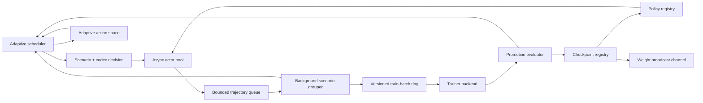

# Architecture

## Contract

The control plane has these stable contracts:

1. `RolloutWorkflow`: user code receives a policy snapshot, a scenario, and a rollout context, then returns a rewarded `Trajectory`.
2. `TrainerBackend`: training consumes `TrajectoryGroup` batches and returns a `TrainResult` with optional replacement policy and checkpoint metadata.
3. `ActionCodec`: policy decisions are represented as semantic `ActionUnit` objects instead of assuming one generated token per action.
4. `AdaptiveScheduler`: rollout selection, train-batch priority, batch cadence, policy lag, action granularity, and continuation are chosen from reward-per-cost feedback.
5. `VersionedTrajectoryBatch`: grouped training payloads carry the policy-step range they were collected under.
6. `PromotionEvaluator`: optional user code decides whether a trained candidate becomes the served checkpoint.
7. `WeightBroadcastChannel`: promoted checkpoint updates are explicit events that inference workers or adapters can subscribe to.
8. `RuntimeTelemetry`: actor, queue, trainer, promotion, reward, cost, and staleness signals are reported in one run summary.
9. `art_adapter`: optional structural conversion for ART `Trajectory` and `TrajectoryGroup` objects without importing ART in the core package.

## Runtime Loop



Actors continuously run user-defined workflows. Completed trajectories enter a bounded queue, so slow grouping applies backpressure rather than unbounded memory growth. A background batcher consumes those trajectories, forms same-scenario groups, and writes `VersionedTrajectoryBatch` objects into a bounded train-batch ring.

The trainer consumes the highest-priority non-stale batch from the ring and returns a candidate policy. A promotion gate decides whether that candidate becomes the served checkpoint and is broadcast. Trajectories whose policy step is older than `max_policy_lag` are dropped during grouping. Whole train batches can also be discarded if they become too stale while waiting in the ring.

## Closed-Loop Objective Scheduler

`ObjectiveScheduler` turns the north-star metric into online control decisions. It treats each `(scenario, action_codec)` pair as an arm, explores every arm, then prefers arms with higher marginal reward improvement per dollar-second. Rollout outcomes provide the first signal; consumed train batches then credit actual train-step improvement back to the arms and active runtime controls that produced the trajectories. Concurrent actor selections reserve in-flight arms until their rollout feedback is observed, preventing high-throughput actors from all choosing the same untried arm before the first result returns. Train credit is arm-baseline-aware: a batch only creates reward-improving experience for an arm when the train score improves over that arm's own previous train score, preventing alternating workflows from inheriting each other's baselines.

The scheduler currently controls six things:

- **Rollout choice:** which `Scenario` an actor attempts next.
- **Action granularity:** which `ActionCodec` the workflow receives in `RolloutContext`.
- **Training priority:** which ready train batch the ring should consume next.
- **Batch cadence:** target train groups per `VersionedTrajectoryBatch`.
- **Policy lag:** current max accepted rollout/checkpoint lag.
- **Continuation:** whether another training step is worth spending on.

Use it by passing multiple codecs and a scheduler:

```python
summary = await ControlPlane(config).run(
    scenarios=scenarios,
    initial_policy=policy,
    trainer=trainer,
    workflow=rollout,
    action_codecs=[TokenActionCodec(), ChunkActionCodec(chunk_size=4)],
    scheduler=ObjectiveScheduler(),
)
```

For an adaptive CALM-like chunk ladder, pass an `AdaptiveActionSpace` instead of a fixed codec list:

```python
summary = await ControlPlane(config).run(
    scenarios=scenarios,
    initial_policy=policy,
    trainer=trainer,
    workflow=rollout,
    action_space=AdaptiveActionSpace(min_chunk_size=2, max_chunk_size=8),
    scheduler=ObjectiveScheduler(),
)
```

The action space starts with token and small chunk codecs. After train feedback updates scheduler metrics, it can promote a larger `ChunkActionCodec` when the current chunk size has positive objective signal, high action quality, and low unsafe rate. Promoted chunk sizes can also be disabled after enough bad evidence, using objective score, action quality, unsafe rate, and pull count. Actors read the current action-space codecs before each rollout, so newly promoted or retired action granularities affect the same run without restarting sample production.

Action-space state is checkpointable. `AdaptiveActionSpace.state_dict()` captures active codecs, disabled codec keys, promotion/demotion counters, and configuration. `load_state_dict()` restores built-in token, chunk, latent-patch, command, and reasoning-step codecs directly; unknown custom codecs are restored only when an equivalent codec is already present on the action space. `ControlPlane` writes this state under `action_space/state` after scheduler feedback has promoted or retired codecs for the train step.

The control loop is online:

1. Actors ask the scheduler for a scenario and action codec, reserving that arm as in-flight until the rollout is observed.
2. Runtime tags the resulting trajectory with the scheduler arm.
3. Workflows or verifiers can attach action-quality metadata such as `action/safe`, `action/quality`, `reconstruction/accuracy`, `reconstruction/safe`, `verifier/score`, or `verifier/passed`.
4. The batcher reports accepted or rejected rollout outcomes, effective reward, action quality, and dollar-seconds.
5. The scheduler scores each candidate train batch from the arms, effective rewards, and quality signals inside it.
6. The ring serves the highest-priority non-stale batch to the trainer.
7. The trainer reports reward movement, useful trajectory count, and train dollar-seconds.
8. The promotion evaluator accepts or rejects the candidate policy and reports candidate score, baseline score, improvement, reason, and evaluation dollar-seconds.
9. The scheduler computes train objective from the promotion-effective score when present, otherwise from `train/reward`.
10. The scheduler distributes that policy-improvement objective back onto the contributing scenario/action-codec arms.
11. The scheduler also credits the active train-batch cadence and policy-lag values used by the consumed trajectories.
12. The adaptive action space can promote or retire higher-bandwidth chunk codecs from that feedback.
13. The scheduler tightens cadence and policy lag when it sees positive marginal objective signal, and can reuse credited cadence or lag settings when they show better train objective.
14. If configured with ROI patience, the scheduler stops the run early after repeated low-objective train steps.

The scheduler deliberately keeps the configured policy-lag allowance until every known arm has at least one accepted sample. That prevents the closed loop from dropping exploratory rollouts before it has enough evidence to compare action granularities.

Arm scoring is objective-weighted. The default score is marginal rollout reward-improvement per dollar-second plus credited train-step policy-improvement objective. Train-step objective uses each arm's `max(0, reward - previous_arm_reward) * useful_trajectory_count / candidate_dollar_seconds`, so larger useful batches earn proportionally more credit than equally improving tiny batches. `candidate_dollar_seconds` is trainer spend plus promotion-evaluation spend for that candidate. Trainer spend can come from explicit trainer metrics or metadata under `cost/dollar_seconds`, `train/dollar_seconds`, or `trainer/dollar_seconds`; otherwise trainer duration is multiplied by the configured infrastructure rate. Raw reward efficiency is reported but has weight `0` unless the caller explicitly sets `reward_efficiency_weight`; this keeps the controller from chasing high raw rollout scores that are no longer improving the policy.

Cadence is pressure-aware and credited. When the train ring is saturated and the scheduler has no positive objective signal, it widens train batches toward `max_train_batch_groups` to amortize trainer spend. When rollout or train feedback shows positive marginal reward improvement per dollar-second, it tightens cadence back to `min_train_batch_groups` so useful gradients are consumed sooner. Actor queue-wait cost is stamped onto trajectories before enqueue and included in the scheduler's rollout denominator, so backpressure can reduce the marginal objective of arms and control settings that create it. Consumed train batches also credit the active cadence and policy-lag values under `scheduler/control/*`, letting later decisions reuse settings that show better train objective than the default heuristic.

Stale train-ring drops are negative feedback, not just telemetry. When a queued `VersionedTrajectoryBatch` becomes too stale to train, the runtime reports the discarded groups through `observe_stale_batch_feedback()`. `ObjectiveScheduler` converts their quality-weighted useful experience into a configurable negative objective credit, debiting the arms, batch-cadence values, and policy-lag values that produced the untrained samples.

Promotion is programmable. Without a `PromotionEvaluator`, every train result is promoted to preserve the simple ART-like training loop. With one, a `TrainResult` becomes a candidate. Rejected candidates still count as train spend and promotion-evaluation spend, but they do not advance `PolicyRegistry`, do not append a checkpoint, and do not publish a `WeightUpdate`. `MetricPromotionEvaluator` promotes only when a chosen result metric improves beyond `min_delta`. `RolloutPromotionEvaluator` runs the candidate policy through held-out `Scenario` objects with the same `RolloutWorkflow` contract used by sample production, then scores quality-adjusted reward and records evaluation failures, semantic bandwidth, duration, and dollar-seconds. Those held-out trajectories are tagged with scheduler arm metadata and passed through `ObjectiveScheduler.observe_rollout()`, so eval reward, action quality, failures, and explicit `eval/dollar_seconds` costs become reusable control evidence. Custom evaluators can run other checks and return `PromotionDecision` directly. The runtime writes promotion score, baseline, improvement, cost, and reason into candidate metrics/metadata; `ObjectiveScheduler.observe_train()` reads `promotion/score` first and divides by trainer plus promotion-evaluation dollar-seconds, so rejected or expensive candidates do not receive false positive policy-improvement credit. Built-in evaluators also write `promotion/state` into accepted checkpoint metadata, preserving the best accepted score and numeric promotion configuration across resumed runs.

Action quality is part of the objective. Unsafe or failed high-bandwidth actions get an effective reward multiplier of `0`, so a risky chunk arm cannot win merely by reporting a high raw reward when reconstruction or verification fails.

Train credit is also quality-aware. A batch can improve the trainer's reported reward, but unsafe or zero-quality trajectories in that batch receive no per-arm policy-improvement credit. This keeps the rollout scheduler pointed at action granularities that produce useful trainable experience rather than merely high raw rollout scores.

ROI patience is opt-in. By default, `ObjectiveScheduler` will run to `max_train_steps`; setting `roi_patience` and `min_train_objective` lets the scheduler stop spending once train-step marginal reward improvement per dollar-second has stayed too low for the configured patience window.

Scheduler state is checkpointable. `state_dict()` captures the numeric control policy memory: arm statistics, decision counts, cadence and lag control credit, stale-drop penalties, budget counters, ROI state, scoring configuration, and scalar last-decision metadata. Live in-flight reservations are not restored across process resume. `load_state_dict()` restores that memory into a fresh scheduler and tolerates missing sections for older checkpoints. `ControlPlane` writes the snapshot into checkpoint metadata under `scheduler/state` after `observe_train()` has credited the consumed batch, so resumed runs see the controller state that produced the published policy. It does not serialize live `Scenario` or `ActionCodec` objects; those remain user-code/programming-layer concerns, preserving ART's control-plane boundary.

Resume uses the same metadata. `restore_control_state()` accepts checkpoint-style metadata, `PolicySnapshot`, or `Checkpoint` objects and loads compatible scheduler, action-space, and promotion-evaluator objects. `ControlPlane.run()` calls it automatically when `initial_policy` is a `PolicySnapshot`; the registry seeds from that snapshot's step, checkpoint id, policy object, and metadata. That keeps policy-lag accounting and promotion gating on the resumed version instead of resetting the async runtime to step 0.

## Puffer-Bridge Semantics

The implemented runtime borrows these Puffer-like rules:

- **Static capacity:** train batches sit in a fixed-capacity ring, configured by `train_queue_capacity`.
- **Backpressure:** when the train ring is full, the batcher blocks; if the trajectory queue fills after that, actors block.
- **Bounded staleness:** every batch records its min/max rollout policy step, and `TrajectoryRingBuffer.get()` rejects batches whose oldest trajectory exceeds `max_policy_lag`.
- **Stale-waste feedback:** rejected train batches call a synchronous discard hook that feeds lost useful experience back into scheduler arm/control credit.
- **Priority consumption:** among non-stale ready batches, the ring consumes the highest scheduler priority first, preserving FIFO only as a tie-breaker.

This keeps the user-facing trainer API simple:

```python
async def train(
    current: PolicySnapshot,
    groups: Sequence[TrajectoryGroup],
) -> TrainResult:
    ...
```

The versioned batch metadata stays in the control plane. A future ART backend can map it onto ART's `initial_policy_version` and `final_policy_version` fields without changing rollout code.

## ART Adapter Boundary

`calm_puffer_art.art_adapter` is the current bridge from ART-shaped local runtime code toward real ART objects. It is deliberately structural:

- It reads ART-like `Trajectory` fields such as `messages_and_choices`, `reward`, `initial_policy_version`, `final_policy_version`, `metrics`, and `metadata`.
- It maps ART `TrajectoryGroup` objects into local `TrajectoryGroup` records for scheduler scoring, staleness filtering, and cost telemetry.
- It preserves the original ART group and trajectory objects in metadata under `art/raw_group` and `art/raw_trajectory`.
- It assigns untagged converted ART trajectories a scenario-scoped default scheduler arm like `scenario_id|art`, while preserving explicit `scheduler/arm_id` metadata from user workflows.
- `ArtBackendTrainer` unwraps those preserved groups and delegates to a supplied ART-like backend with `train(model, trajectory_groups, **kwargs)`.
- `AsyncArtBackend` exposes backend-shaped `register()`, `train()`, `submit_train()`, `submit_group()`, `flush_pending_groups()`, `_get_step()`, `_model_inference_name()`, and `close()` methods around the same fixed-capacity stale-aware train ring.

This means the async runtime can reason about ART data without taking a hard dependency on ART or reimplementing ART's GRPO/CISPO losses. The full drop-in `art.Backend` remains deferred; this adapter is the tested object-preservation seam it should use.

`AsyncArtBackend.train()` returns the supplied backend's train result for compatibility. Internally, the submitted ART groups are converted, prioritized, enqueued, consumed by a background trainer task, observed by the scheduler, and published through `WeightBroadcastChannel`. Published ART bridge updates include `scheduler/state` metadata after train feedback is observed. Before each consume, the bridge asks `scheduler.max_policy_lag(...)` for the active stale-policy limit. If a queued batch exceeds that limit before training, the awaiting caller receives `StaleArtBatchError` instead of hanging, and the scheduler receives stale-batch feedback for the discarded groups.

`submit_train()` is the nonblocking path. It returns an `asyncio.Future` once the bounded ring has accepted the converted ART groups. The caller can continue producing rollouts and await the future later. Backend stats report submitted, completed, failed, and stale batches under `art_backend/*`.

`submit_group()` is the scheduler-cadenced path. It accepts one ART `TrajectoryGroup`, converts it, and holds it in a pending group buffer until `scheduler.target_train_batch_groups(...)` says enough compatible groups are ready. `flush_pending_groups()` forces a partial flush for shutdown, evaluation, or short runs. Together with scheduler-controlled policy lag, this gives the ART bridge the same cadence and staleness controls as the local runtime batcher.

## Weight Updates

`WeightBroadcastChannel` publishes `WeightUpdate` events after every checkpoint:

```python
channel = WeightBroadcastChannel()
updates = channel.subscribe()

summary = await ControlPlane(config).run(
    scenarios=scenarios,
    initial_policy=policy,
    trainer=trainer,
    workflow=rollout,
    action_codec=codec,
    weight_channel=channel,
)
```

Today this is an in-process event stream. In a real ART/vLLM bridge, the same event would point inference workers at the newly saved LoRA adapter while in-flight requests complete under their tagged policy version.

## Semantic Bandwidth

The runtime treats action granularity as a codec choice:

- `TokenActionCodec`: baseline one-token-ish decision units.
- `ChunkActionCodec`: `K` whitespace tokens per decision, useful for quick bandwidth experiments.
- `LatentPatchActionCodec`: deterministic inspectable patch vectors that stand in for learned CALM-style chunk embeddings.
- `CommandActionCodec`: structured tool/command units.
- `ReasoningStepCodec`: compressed line-level reasoning or plan steps.
- `AdaptiveActionSpace`: conservative online chunk-size promotion and retirement from objective and quality metrics.

The codec interface deliberately preserves decoded text for compatibility with existing ART-like message trajectories while exposing `action_units`, `token_count`, and `semantic_bandwidth` for metrics.

The torch-backed CALM autoencoder sketch is intentionally not imported into the default package. It should land behind an optional integration layer after the runtime contract is stable, because chunk-level latent logprobs need careful old/new policy-ratio semantics before they are safe to feed into GRPO.

For CALM-like codecs, verifier and reconstruction feedback should be written into trajectory metadata:

```python
Trajectory(
    ...,
    metadata={
        "action/safe": True,
        "action/quality": 0.97,
        "reconstruction/accuracy": 0.99,
        "verifier/passed": True,
    },
)
```

The runtime and scheduler use the minimum available quality signal as the effective-reward multiplier.

`AdaptiveActionSpace` uses the same scheduler metrics for promotion and retirement, so unsafe or poor-reconstruction chunk arms do not unlock larger chunks and promoted arms with enough bad evidence stop competing for rollout slots. Token and the minimum chunk size remain active as comparison baselines. This is a runtime control surface, not a learned CALM encoder; learned latent policies remain deferred until old/new logprob semantics are explicit.

## North-Star Metric

`reward_improving_experience_per_dollar_second` is calculated as:

```text
max(0, last_reward_window_mean - first_reward_window_mean)
* accepted_trainable_trajectories
/ max(wall_clock_seconds * cost_per_second_usd, epsilon)
```

This makes raw throughput insufficient on its own: a run that produces many trajectories without improving reward scores poorly.

The scheduler uses the same numerator shape for train feedback. It reports `scheduler/train_last_reward_improvement`, `scheduler/train_last_experience_count`, and `scheduler/train_last_reward_improving_experience` so the local control signal can be audited against the run-level north-star.

The runtime also reports attributed cost telemetry:

- `costs/wall_clock_dollar_seconds`: elapsed runtime multiplied by configured infrastructure cost.
- `costs/rollout_dollar_seconds`: summed explicit rollout costs from `cost/dollar_seconds` or `rollout/dollar_seconds`, falling back to rollout duration multiplied by configured cost.
- `costs/trainer_dollar_seconds`: summed explicit train costs from `cost/dollar_seconds`, `train/dollar_seconds`, or `trainer/dollar_seconds`, falling back to trainer duration multiplied by configured cost.
- `costs/promotion_eval_dollar_seconds`: promotion-gate evaluation spend, including held-out workflow rollouts or custom evaluator cost.
- `costs/actor_queue_wait_dollar_seconds`: actor time spent waiting on bounded queues.
- `costs/accounted_dollar_seconds`: rollout, trainer, promotion-evaluation, and queue-wait attribution combined.
- `north_star/accounted_reward_improving_experience_per_dollar_second`: the same reward-improvement numerator divided by accounted cost.

`costs/runtime_dollar_seconds` remains the wall-clock infrastructure denominator for compatibility. The accounted denominator is useful when tuning actor count, train cadence, model/API spend, promotion gates, or backpressure because it exposes where the local scaffold is spending work. Scheduler arm metrics also expose `mean_rollout_dollar_seconds`, `queue_wait_dollar_seconds`, `mean_queue_wait_dollar_seconds`, `mean_sample_dollar_seconds`, and `total_improvement_per_dollar_second` for auditing whether a scenario/action-codec arm is actually worth its observed rollout and queue-wait cost.

## Implementation Boundary

Implemented now:

- Continuous actor pool.
- Background trajectory grouping.
- Fixed-capacity train-batch ring.
- Priority-aware train-batch consumption.
- Per-trajectory and per-batch staleness filtering.
- Explicit checkpoint broadcast events.
- Dependency-free ART trajectory/group adapter and delegating trainer wrapper.
- Structural `AsyncArtBackend` with register/submit/train/group-flush/close lifecycle, stale-batch failure, scheduler observation, and checkpoint broadcast.
- Objective-driven adaptive scenario, action-codec, batch-cadence, and policy-lag selection.
- Online action-space promotion and retirement across chunk codecs.
- Action-space `state_dict()` / `load_state_dict()` snapshot and restore for resumable semantic-bandwidth control.
- Train-step policy-improvement credit assignment back to rollout/action arms.
- Explicit rollout dollar-second overrides for API/token/tool/GPU cost accounting.
- Explicit train dollar-second overrides for trainer/API/GPU cost accounting.
- Pressure-aware train cadence that widens low-ROI batches under trainer saturation.
- Rollout, trainer, queue-wait, wall-clock, and accounted cost telemetry.
- Actor queue-wait cost attribution into scheduler rollout objective denominators.
- Stale train-batch discard feedback into scheduler arm, cadence, and policy-lag objective memory.
- Promotion-gated checkpoint publication with promotion cost telemetry and promotion-effective scheduler credit.
- Static-vs-objective ablation harness that asserts positive north-star lift from scheduler control.
- Quality-aware effective reward for unsafe or low-fidelity action granularities.
- Opt-in ROI-based early stopping when marginal train objective is exhausted.
- Semantic action codecs that preserve decoded text and expose bandwidth metrics.
- Scheduler `state_dict()` / `load_state_dict()` snapshot and restore for checkpointable control-policy memory.
- Checkpoint metadata for `scheduler/state` and `action_space/state` on local runtime checkpoint broadcasts.
- `PolicySnapshot` resume support in `ControlPlane`, including restored scheduler/action-space state before actor startup.

Deferred:

- Production packaging as a drop-in `art.Backend` against live ART versions.
- Real GRPO/CISPO loss calls against ART internals.
- vLLM LoRA hot-reload wiring.
- Torch/CALM autoencoder training, checkpoint loading, and chunk-level policy heads.
